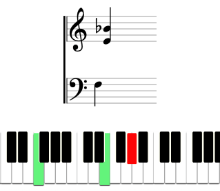

# Note Training

Improve your piano note reading skills. Connect piano to your computer via MIDI interface and start play. 



Check out the [Live Demo](#)

### Local setup

1. Install dependencies

    ```shell
    yarn install
    ```

2. Run server

    ```shell
    yarn dev
    ```

3. Open in browser

### TODO List

- Validation for settings
- Restore form state after close without saving
- Layout fixes

### Licence

MIT
